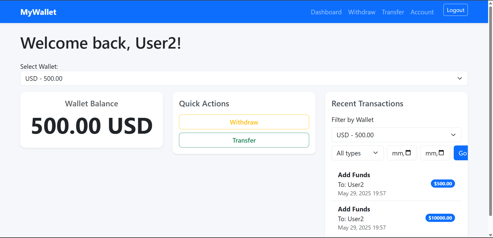
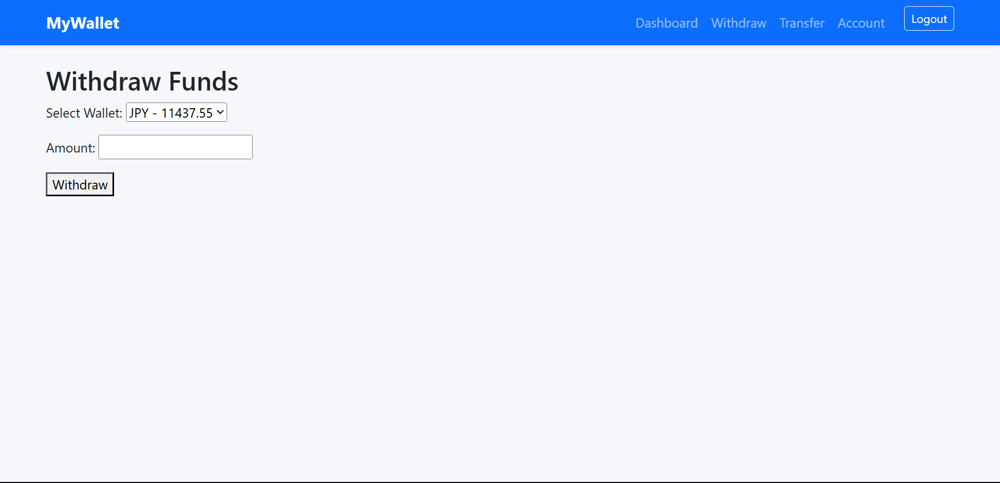
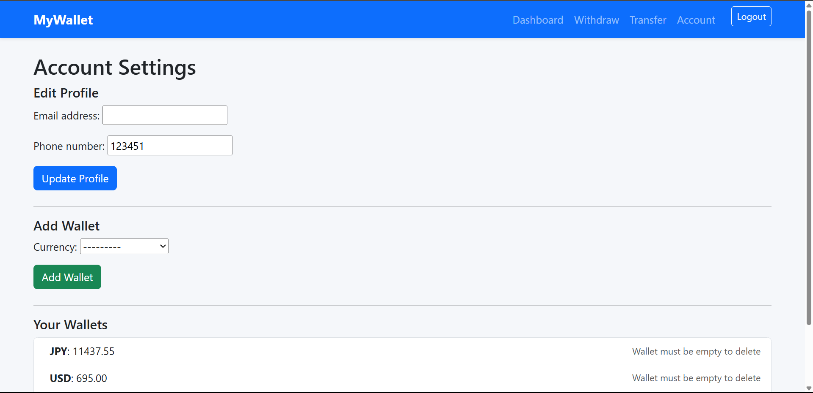

## 💳 Django Digital Wallet
A web-based digital wallet application built with Django and styled using Bootstrap. It allows users to register, manage multiple wallets in different currencies, transfer funds, and view detailed transaction histories. Admins can manage user funds and wallets through a secure interface.

## 🔍 Features
✅ **User Registration & Login**  
• Secure authentication  
• Email verification flow  
• Unique username and email required  

✅ **Admin Fund Management**  
• Admins can dynamically select a user and fund their wallets  
• AJAX-powered dropdown shows only that user’s wallets  

✅ **Multiple Wallets per User**  
• Users can add wallets in different currencies  
• Admin can view and manage each wallet  

✅ **Dashboard by Wallet**  
• Users can select a wallet from a dropdown to view relevant transactions  
• Streamlined dashboard experience focused on individual wallet activity  

✅ **Fund Transfers Between Users**  
• Users can securely transfer funds to others  
• Prevents self-transfers and validates available balance  
• **Currency conversion** occurs when transferring between wallets of different currencies using exchange rates  

✅ **Withdraw Funds**  
• Users can withdraw from any of their wallets  
• **Wallet selection** required to withdraw from the correct account  
• Proper balance checks in place  

✅ **Transaction History**  
• Filterable by wallet, type, and date  
• Most recent 10 transactions shown  
• Icons and labels for clarity  

**Types**:  
• 📤 Sent Transfers  
• 📥 Received Transfers  
• 💸 Withdrawals  
• ➕ Admin-added Funds  

✅ **Role-Based Access**  
• Only staff/admins can add funds  
• Normal users can only withdraw or transfer  

✅ **Wallet Selection & Filtering**  
• Dashboard wallet dropdown to focus on one wallet  
• AJAX updates the wallet dropdown when admin selects a user  
• Filter recent transactions by wallet and type  

✅ **Editable Profile**  
• Update email and phone with current values shown  
• Clean design with validations 

## 📅 Future Features

- [ ] Admin Panel Improvements (bulk actions, analytics)
- [ ] Improve app design for better usability and aesthetics

## 🛠️ Technologies Used

• Backend: Django (Python)
• Frontend: HTML, CSS, Bootstrap 5
• Database: PostgreSQL
• Authentication: Django built-in AbstractUser with email and phone fields
• AJAX: JavaScript + Django JsonResponse for dynamic UI

## 🚀 Getting Started
Prerequisites
Python 3.8+

pip
Virtualenv (recommended)
Installation
Clone the repository

bash
git clone https://github.com/your-username/django-digital-wallet.git
cd django-digital-wallet
Set up the virtual environment

bash
python -m venv env
source env/bin/activate  # On Windows: env\Scripts\activate
Install dependencies

bash
pip install -r requirements.txt
Run migrations

bash
python manage.py migrate
Create a superuser

bash
python manage.py createsuperuser
Start the development server

bash
python manage.py runserver

## 📸 Interface Previews

### 🏠 Dashboard Overview  
Easily monitor wallet balances and transaction history with a focused view by wallet.

### 💸 Withdraw Funds  
Select the wallet to withdraw from and enter the amount with balance validation.

### 🔄 Transfer Funds  
Send money to another user’s wallet — with automatic currency conversion when needed.

### ⚙️ Account Settings  
Update your email and phone number with real-time validation and clean form design.

